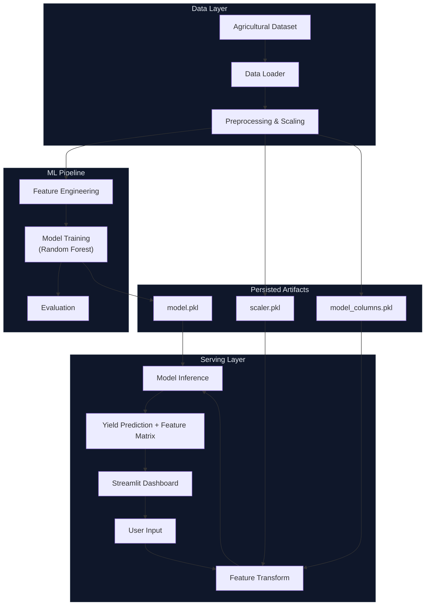

# NexusYield

**Intelligent Agronomy Engine**

An end-to-end machine learning system that predicts crop yield (Tons / Hectare) based on environmental parameters and intervention strategies. Wait, what does it mean? It provides real-time decisions through a production-grade Streamlit dashboard — built to mirror how modern agritech teams evaluate harvest probability.

---

## Problem Statement

Predicting agricultural yields is complex, reliant on non-linear weather patterns, soil composition, and farming techniques. Traditional rule-based farming estimates miss subtle synergies between variables.

This project builds a **complete prediction pipeline**: from raw agronomy data to a deployable web interface that an agricultural analyst or farmer could use to evaluate a field yield in under 30 seconds, with transparent feature importance impact.

---

## Demo

*(Demo image placeholder - Add screenshot to `screenshots/` directory)*

---

## Features

- **Full ML Pipeline** — data ingestion, preprocessing (scaling & dummy encoding), model training, evaluation, and serving
- **Explainability** — Feature importance matrix analysis for every prediction 
- **Production UI** — dark-themed, animated glassmorphism dashboard built with Streamlit
- **Intervention Evaluation** — toggle chemical fertilizer and active irrigation parameters
- **Deployment-Ready** — absolute path resolution, single-command launch

---

## Tech Stack

| Layer | Technology |
|---|---|
| Language | Python 3.14 |
| ML Framework | scikit-learn |
| Backend/UI | Streamlit |
| Data | Pandas, NumPy |
| Serialization | Joblib |

---

## System Design



---

## Project Structure

```
genai_capstone/
├── notebooks/
│   └── notebook.ipynb                        # Initial EDA, preprocessing, and training
├── src/
│   ├── train_local.py                        # Local re-training script
│   └── read_models.py                        # Model artifact inspection utility
├── models/
│   ├── model.pkl                             # Trained Random Forest 
│   ├── scaler.pkl                            # Fitted StandardScaler
│   └── model_columns.pkl                     # Encoded feature column alignment
├── app.py                                    # Streamlit dashboard (self-contained UI)
├── data/
│   └── crop_yield.csv                        # Raw dataset
├── screenshots/                              # UI screenshots directory
├── requirements.txt
└── README.md
```

---

## Machine Learning Pipeline

```
Raw Data 
    │
    ▼
Preprocessing (One-Hot Encoding + Standard Scaling)
    │
    ▼
Model Training (Random Forest)
    │
    ▼
Evaluation (R-Squared Score)
    │
    ▼
Feature Impact (Top 5 contributing variables)
    │
    ▼
Streamlit Dashboard (Real-Time Prediction + Glassmorphism UI)
```

---

## Installation & Setup

**Prerequisites:** Python 3.x

```bash
# 1. Clone the repository
git clone <your-repo-link>
cd genai_capstone

# 2. Create virtual environment
python3 -m venv venv
source venv/bin/activate        # macOS/Linux

# 3. Install dependencies
pip install -r requirements.txt
```

---

## Usage

### Run the Dashboard

```bash
python3 -m streamlit run app.py
```

Opens at **http://localhost:8501**

### Retrain the Model

To run the local training pipeline that re-generates `.pkl` files in the `models/` directory:

```bash
python3 src/train_local.py
```

---

## Key Highlights

> Designed for rapid agritech evaluation scanning in 30 seconds.

- End-to-end ML system: data → features → model → UI
- Production-grade Streamlit dashboard with custom dark animated aesthetic
- Clean, modular codebase with separated concerns (`src/`, `models/`, `data/`)
- Fast Random Forest inference

---

## License

This project is open-source.
